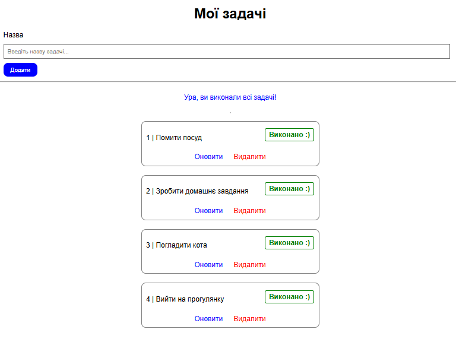

# ToDo List Application

Веб-додаток для управління списком задач.

## Функціонал

- **Головна сторінка**: перегляд усіх задач у списку.
- **Додавання задачі**: можливість створити нову задачу із назвою.
- **Оновлення статусу задачі**: відмітка виконання задачі.
- **Видалення задачі**: можливість видалити задачу зі списку.
- **Інформування користувача**: повідомлення про виконання всіх задач або помилки при створенні задачі.

## Технології

- **Backend**: Python + Flask.
- **Frontend**: HTML + CSS.
- **Дані**: зберігаються у вигляді списку в оперативній пам'яті.

## Скріншоти

Головна сторінка програми:

Додаток створений для практики веб-розробки з використанням Flask.
